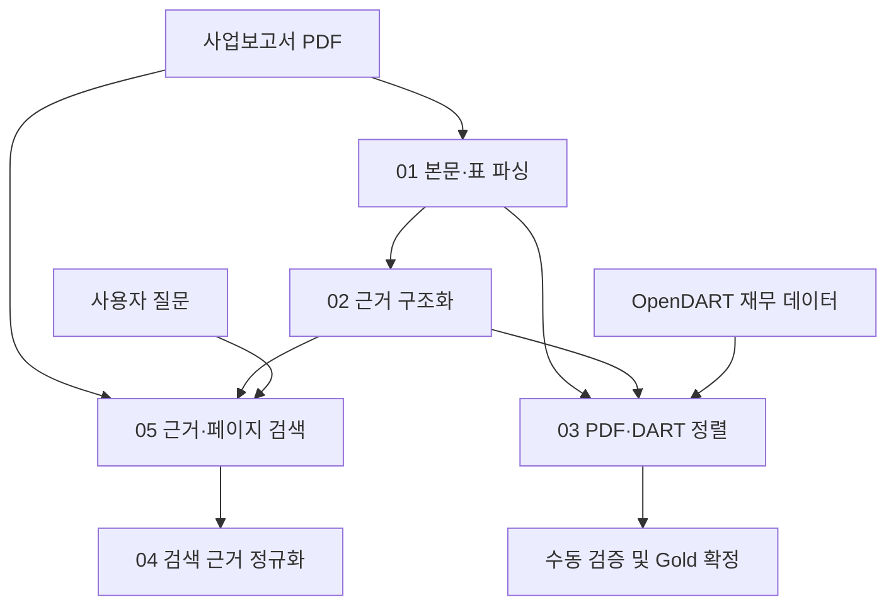

# CAUSE-RAG

**기업 공시 문서의 근거 구조화·검색·정규화를 위한 연구 파이프라인**

CAUSE-RAG는 텍스트·표·페이지 이미지에서 얻은 근거를 공통 형식으로 표현하여, 근거 간 수치·단위·기간·범위 차이를 분석하고 신뢰할 수 있는 답변을 생성하는 것을 목표로 합니다.

현재 코드는 사업보고서 PDF 파싱, 근거 구조화, OpenDART 기반 Gold 구축, 멀티모달 하이브리드 검색, 검색 근거 정규화를 구현합니다. **충돌 판정, 근거 신뢰도 기반 조정, 최종 답변 생성은 후속 구현 범위입니다.**

## 1. 주요 기능

- **원문 기반 PDF 파싱**: PyMuPDF로 본문을 추출하고 pdfplumber·img2table의 표 후보를 비교·선택합니다.
- **근거 구조화**: Entity, Metric, Value, Unit, Period, Scope, Version과 출처 정보를 보존합니다.
- **검수 가능한 Gold 구축**: 공시 접수번호를 확인한 OpenDART 재무 데이터와 PDF 근거를 정렬하고, 수동 검증한 행만 최종 Gold로 확정합니다.
- **멀티모달 하이브리드 검색**: 구조화 근거와 PDF 페이지에 대해 임베딩·BM25 검색을 수행하고, 후보 페이지 이미지의 질문 관련성을 비전 모델로 재평가합니다.
- **질문 중심 근거 정규화**: 질문과 Top-5 근거를 개별 LLM 요청으로 구조화하고, 수치·단위 변환은 Python 규칙으로 다시 계산합니다.

## 2. 현재 데이터 범위

| 항목 | 현재 코드 설정 |
| --- | --- |
| 기업 | 삼성전자, SK하이닉스, 현대자동차 |
| 사업연도 | 2024, 2025 |
| 입력 문서 | 기업·사업연도별 사업보고서 PDF, 총 6개 조합 |
| 문서 조건 | 텍스트 추출이 가능한 PDF |
| 파싱 범위 | 사업보고서 전체의 본문 및 표 |
| OCR | 사용하지 않음 |

사업연도는 보고서 발행연도와 구분합니다. 보고서에 포함된 비교 수치의 측정 연도 역시 보고서의 사업연도와 별도로 보존합니다.

`01_parse_audit_reports.py`의 `TARGETS`, `TARGET_FISCAL_YEARS`와 기업·연도 조합 검증은 위 데이터 구성을 전제로 합니다. 다른 기업이나 연도를 사용할 때는 관련 설정과 검증 로직을 함께 점검해야 합니다.

## 3. 파일 구성

저장소 루트에 아래 이름으로 Python 파일을 배치합니다. 업로드 사본에 붙은 `(1)`, `(2)`는 제거합니다. 특히 03은 `02_structure_evidence.py`를 참조하고, 05의 자동 정규화 호출은 `04_normalize_retrieved_evidence.py`를 기준으로 연결됩니다.

| 파일 | 역할 | 주요 출력 위치 |
| --- | --- | --- |
| `01_parse_audit_reports.py` | PDF 본문·표 추출, 표 앙상블 및 품질 진단 | `dataset/01_parsed/` |
| `02_structure_evidence.py` | 파싱 결과를 근거 스키마로 구조화하고 DART 정렬 후보 생성 | `dataset/02_structured/` |
| `03_build_dart_gold.py` | OpenDART 참조 데이터 수집, PDF 정렬, 수동 검증 기반 Gold 확정 | `dataset/03_dart_gold/` |
| `04_normalize_retrieved_evidence.py` | 질문 및 검색 근거의 의미 추출·정규화 | `dataset/04_normalized/` |
| `05_retrieve_evidence.py` | 근거·페이지 검색, 비전 재순위화, Top-5 생성 및 04 호출 | `dataset/05_retrieval/` |

원본 PDF는 스크립트와 같은 디렉터리 아래의 `pdf_data/`에 배치합니다. 기본 입력·출력 경로는 각 스크립트의 위치를 기준으로 결정됩니다.

## 4. 파이프라인

파일 번호와 실제 실행 순서는 다릅니다. **검색·정규화 경로는 `01 → 02 → 05 → 04`**, Gold 구축 경로는 `01·02 → 03 → 수동 검증 → 03 --finalize`입니다.



Gold 데이터는 검색 인덱스에 포함하지 않습니다. 05의 비전 점수는 **질문 관련성 점수**이며, 후속 연구 단계의 근거 신뢰도나 충돌 판정 결과가 아닙니다.

## 5. 설치 및 설정

아래는 Windows CMD 기준 예시입니다. 패키지 버전이 고정된 재현 환경은 별도로 제공하지 않으므로, 실험 시 실제 Python·패키지 버전을 기록합니다.

```bat
python -m venv .venv
.venv\Scripts\activate
python -m pip install pymupdf pdfplumber img2table pandas requests openai pydantic numpy
```

필요한 API 키를 환경변수로 설정합니다.

```bat
set DART_API_KEY=YOUR_DART_API_KEY
set OPENAI_API_KEY=YOUR_OPENAI_API_KEY
```

| 설정 | 사용 단계 | 코드상 기본값 |
| --- | --- | --- |
| `DART_API_KEY` | 03 참조 데이터 수집 | 사용자 설정 필요 |
| `OPENAI_API_KEY` | 04, 05 | 사용자 설정 필요 |
| `OPENAI_MODEL` | 04 및 05에서 호출하는 정규화 모델 | `gpt-4o-mini` |
| `OPENAI_EMBEDDING_MODEL` | 05 임베딩 | `text-embedding-3-large` |
| `OPENAI_VISION_MODEL` | 05 페이지 이미지 재순위화 | `gpt-4o-mini` |

05의 기본 임베딩 차원은 1024입니다. 표의 모델명은 코드에 지정된 기본 설정이며, 실제 실행은 해당 모델 및 API 기능에 접근할 수 있는 환경을 전제로 합니다. 04·05는 근거 텍스트와 후보 페이지 이미지 등을 외부 API에 전달하며 사용량에 따른 비용이 발생할 수 있습니다.

## 6. 실행 방법

### 6.1 PDF 파싱과 근거 구조화

```bat
python 01_parse_audit_reports.py
python 02_structure_evidence.py
```

선택된 표 영역을 PDF에서 확인하려면 파싱 시 `--save-debug-pdfs`를 사용합니다. 비재무 표의 미등록 지표를 더 넓게 보존하려면 구조화 시 `--include-unknown-nonfinancial`을 사용합니다.

01은 표의 첫 행을 자동으로 버리지 않고 원본 행을 보존합니다. 여러 페이지에 걸친 표는 페이지별 출처를 유지하면서 보수적인 규칙으로 `table_group_id`를 부여합니다. 02는 다중 행 헤더와 연결된 표의 문맥을 활용하고, 파서 품질 진단 정보를 근거에 전달합니다.

### 6.2 검색부터 정규화까지 실행

```bat
python 05_retrieve_evidence.py --mode run --question "2025년 연결 기준 삼성전자의 영업이익은?"
```

기본 `run` 모드는 인덱스 구축, 검색, Top-5 저장, 04 자동 호출을 수행합니다. 이미 인덱스가 있으면 `--skip-build`로 구축 단계를 생략할 수 있습니다.

```bat
python 05_retrieve_evidence.py --mode run --skip-build --question "2025년 연결 기준 삼성전자의 영업이익은?"
```

인덱스 구축과 검색을 분리하거나 정규화를 별도로 실행할 수도 있습니다.

```bat
python 05_retrieve_evidence.py --mode build
python 05_retrieve_evidence.py --mode query --question "2025년 연결 기준 삼성전자의 영업이익은?"
python 04_normalize_retrieved_evidence.py --input dataset/05_retrieval/retrieval_input.json
```

| 옵션 | 동작 |
| --- | --- |
| `--mode build` | 인덱스만 구축 |
| `--mode query` | 기존 인덱스로 검색; 04 자동 호출 없음 |
| `--mode run --retrieval-only` | 인덱스 구축·검색 후 종료 |
| `--skip-vision-rerank` | 비전 재순위화 생략; 임베딩 API 호출은 유지 |
| `--top-k` | 검색 결과 개수 설정; 04 자동 연결 시 5개 필요 |

04는 기본적으로 근거가 정확히 5개인 입력을 요구합니다. 단독 실행에서 가변 개수의 근거를 다루려면 `--allow-variable-k`를 사용합니다. 출력 기본 경로는 질문별로 분리되지 않으므로 여러 실험 결과를 보존하려면 출력 경로 옵션을 지정하거나 실행별로 결과를 보관합니다.

### 6.3 평가용 Gold 구축

검색·정규화 실행과 별도로 수행합니다.

```bat
python 03_build_dart_gold.py
```

생성된 `dataset/03_dart_gold/gold_review_template.csv`를 원문과 대조하여 검토하고, 확인한 행에 `manual_verified=Y`를 기록합니다. 필요한 경우 `manual_label`, `manual_note`를 함께 작성한 후 최종 Gold를 생성합니다.

```bat
python 03_build_dart_gold.py --finalize
```

03은 DART 정답 수치를 이용해 PDF 후보를 고르지 않습니다. 먼저 비수치 기준으로 후보를 정렬·선택한 뒤 값을 비교합니다. PDF에 대응하는 공시와 API 응답의 접수번호가 다르면 엄격한 버전 불일치로 처리하고, 정확한 공시의 XBRL을 진단용으로 내려받습니다. 다른 공시 버전을 자동으로 정답으로 대체하지 않습니다.

### 6.4 내장 자체 점검

04·05에는 외부 API를 사용하지 않는 자체 점검 옵션이 있습니다.

```bat
python 04_normalize_retrieved_evidence.py --self-test
python 05_retrieve_evidence.py --self-test
```

자체 점검은 실제 보고서 전체 처리나 외부 API 연동의 성공을 보장하는 통합 테스트는 아닙니다.

## 7. 정규화 스키마

02는 전체 코퍼스를 검색 가능한 근거로 구조화하고, 04는 검색 이후 질문을 기준으로 각 근거를 다시 구조화·정규화합니다.

| 구분 | 04 주요 필드 | 의미 |
| --- | --- | --- |
| 원문 | `raw_content`, `evidence_span` | 입력 원문과 추출 판단의 근거 구간 |
| 기업 | `entity_raw`, `entity`, `entity_key` | 원문 기업 표현과 정규화된 기업·키 |
| 지표 | `metric_raw`, `metric`, `metric_key` | 원문 지표 표현과 정규화된 지표·키 |
| 수치 | `value_text_raw`, `value_raw`, `value_parsed`, `value_normalized` | 수치 구절, 원문 숫자, 파싱 값, 변환 값 |
| 단위 | `unit_raw`, `unit_normalized`, `conversion_multiplier`, `unit_dimension` | 원문 단위와 정규화 단위·배율·차원 |
| 기간 | `period_raw`, `period_start`, `period_end`, `period_precision`, `period_type` | 원문 기간, 시작·종료, 정밀도와 유형 |
| 범위 | `scope_raw`, `scope` | 연결·별도 등 측정 범위 |
| 재무제표 | `statement_raw`, `statement` | 재무제표 종류 |
| 버전 | `version_raw`, `version` | 원본·정정 등 버전 표현 |
| 출처·진단 | `source_metadata`, `confidence`, `warnings` | 출처 메타데이터, 추출 신뢰도와 경고 |

LLM은 의미 추출을 담당하고, 수치·단위 산술 변환은 Python `Decimal` 기반 규칙으로 수행합니다. 비교에 필요한 값뿐 아니라 원문 숫자와 단위를 함께 보존합니다. 후속 단계용 그룹 키는 Entity + Metric이며, 기간·범위·단위 및 값·버전 비교를 위한 정보를 제공합니다.

현재 04는 각 입력 근거마다 질문 중심의 추출 레코드를 생성합니다. 한 페이지의 모든 주장과 수치를 빠짐없이 분해하는 다중 주장 추출기는 아닙니다. 원문 보존이나 규칙 기반 계산만으로 의미 추출의 정확성이 보장되지는 않으므로, 복합 금액·모호한 헤더·기간 표현 등은 경고와 원문을 함께 검수해야 합니다.

## 8. 주요 산출물

| 단계 | 산출물 | 용도 |
| --- | --- | --- |
| 01 | `parsed_blocks.jsonl`, `document_manifest.csv` | 원문 블록과 문서 메타데이터 |
| 01 | `table_candidates.csv`, `table_qc.csv`, `page_text_qc.csv`, `multipage_table_groups.csv` | 표 후보·품질·페이지 텍스트·연속 표 진단 |
| 02 | `structured_evidence.jsonl`, `structured_evidence.csv` | 전체 구조화 근거 |
| 02 | `dart_alignment_candidates.csv`, `manual_review_candidates.csv`, `table_structure_diagnostics.csv` | Gold 정렬 후보와 구조화 검수 |
| 03 | `dart_reference_evidence.csv`, `dart_pdf_alignment.csv`, `gold_review_template.csv` | DART 참조·정렬·수동 검수 |
| 03 | `gold_evidence.jsonl`, `gold_evidence.csv`, `gold_core.csv` | 수동 검증 후 확정한 Gold |
| 05 | `cause_rag_multimodal.db` | SQLite 검색 인덱스 |
| 05 | `retrieval_input.json` | 04에 전달하는 질문과 검색 근거 |
| 05 | `multimodal_context.json`, `page_images/`, `retrieval_diagnostics.json` | 페이지·크롭 이미지 문맥과 검색 진단 |
| 04 | `normalized_bundle.json`, `normalized_records.jsonl` | 정규화된 질문·근거 |
| 04 | `normalization_schema.json`, `normalization_summary.json` | 정규화 스키마와 실행 요약 |

## 9. 구현 범위와 후속 연구

- 현재 구현: 네이티브 PDF 텍스트·표 추출, 구조화, 검수 기반 Gold 구축, 페이지 이미지 기반 검색 재순위화, 검색 근거 정규화.
- 후속 구현: Apparent/Genuine Conflict 판정, 충돌 원인 분류, 근거 신뢰도 추정 및 조정, 최종 답변 생성·보류.
- 현재 한계: OCR 미지원, 독립적인 차트 수치 추출 모듈 미포함, 입력 문서의 구조와 추출 품질에 따른 오류 가능성.

04 실행 후 `Conflict detection/filtering was intentionally NOT applied in Stage 04.`가 출력되는 것은 해당 단계가 구조화·정규화까지만 수행한다는 안내입니다.

성능 수치와 실험 결과는 이 README에 포함하지 않았습니다. 후속 실험에서는 Gold 구축 이력, 모델·패키지 버전, 검색 설정, 정규화 오류, 충돌 판정 및 답변 품질을 함께 기록합니다.

## 10. 저장소 관리

API 키와 로컬 실행 산출물을 실수로 커밋하지 않도록 다음 `.gitignore` 구성을 사용할 수 있습니다. 데이터 공개 범위가 정해지면 필요한 검증 데이터만 별도로 관리합니다.

```gitignore
.venv/
__pycache__/
*.py[cod]
.env
.env.*
!.env.example
dart_api_key.txt
pdf_data/
dataset/
```

**연구팀: RAGON**
